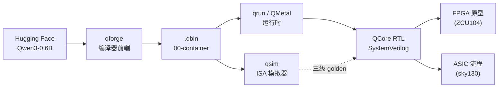

# QCore — 个人级开源 LLM 推理加速平台

> 下载真实 Qwen → 自己设计的编译器 → 自己设计的机器指令 → 自己写的 SystemVerilog
> 处理器真正执行 → 生成正确的自然语言。

QCore 是一套面向 Transformer/LLM 推理的**个人级完整开源 AI 加速平台**：编译器、ISA、
Runtime、RTL 全部独立设计，实现 Hugging Face 的 Qwen 模型「一键编译并部署」到自己的加速器。
参考 Tenstorrent TT-Forge 的软硬件分层思想，不以绝对性能对标商业芯片，以**体系完整度**对标
Tenstorrent——要证明的不是「我会设计 GEMM 加速器」，而是**端到端全链路可运行、可复现**。

发布形式：完整开源项目 + 系列知乎文章（大纲见 [`docs/zhihu-outline.md`](docs/zhihu-outline.md)）。

## 架构总览

```text
Hugging Face / PyTorch ─► Model Frontend ─► Q-MLIR ─► QNN/LLM IR
      ─► Hardware-aware Compiler ─► Q-ISA ─► qsim (ISA Simulator)
      ─► QMetal Runtime ─► QCore RTL ─► FPGA Prototype ─► ASIC Synthesis
```



- **Q-ISA**：Tensor Command ISA（33 条，128-bit 编码），非 scalar CPU ISA。
- **QCore**：Command Processor + Matrix/Vector/DMA/KV 引擎 + 8 MiB Scratchpad SRAM + 16 GiB HBM；
  FPGA 原型以 DDR 替代 HBM。
- **三级 Golden Reference**（总验证原则）：PyTorch → qsim → RTL/FPGA 三者输出在规定精度内一致。

## 目录结构

```text
compiler/      Q-ISA 编码器/汇编器 + Q-MLIR 方言 + lowering（isa.py / qbin.py / mlir/）
qforge/        HF → .qbin 编译前端（CLI / 建图 / 量化 / 打包 / tiling / 调度）
qrun/          QMetal 运行时 + CLI（.qbin → 逐 token 生成）
qsim/          ISA 模拟器（功能级 executor + 时序级 timing / timing_p6）
rtl/           QCore SystemVerilog（matrix/vector/dma/kv 引擎 + CP + SRAM + co-sim tb）
fpga/          板卡无关接口层（clock_reset / host_if / ddr_if + 集成 smoke）
asic/          ASIC 流程（Yosys + sky130 综合 / OpenSTA / 门级网表）
golden/        P1 golden 参考（Qwen3-0.6B 中间 tensor/KV/logits dump）
ref/           PyTorch 参考实现（model.py / baseline.py / roofline.py）
docs/          规格（spec.md + spec-src/）与各节点报告（p1–p10）
plans/         各节点计划与评审记录
```

## 里程碑状态

| 里程碑 | 判定条件 | 节点 | 状态 |
|--------|----------|------|------|
| M0 | spec 冻结（33 指令 / 容器 / KV 协议，15 条审计全裁决） | P0 | ✅ 2026-08-13 |
| M1 | 0.6B golden 与 HF 一致 + roofline | P1 | ✅ |
| M2 | M2a 单层 MLIR→Q-ISA→qsim 数值正确；M2b qsim 时序跑通 layer trace | P2+P3 | ✅ |
| M3 | qforge 产出可加载 .qbin | P4 | ✅ |
| M4 | qrun 输出与 HF 逐 token 一致 | P5 | ✅（BF16 短/中/长 ctx 全过） |
| M5 | decode 达 sustained roofline 80%+ | P6 | ✅ |
| M6 | RTL co-sim 与 qsim 逐指令一致 | P7 | ✅ |
| M7 | 三级 golden（PyTorch=qsim=RTL）一致 | P8 | ✅（15 实例 + 逐层 0 ULP） |
| M8 | FPGA 上板生成真实 token | P9 | ⏳ 阻塞（板卡采购，见 `docs/p9/board-candidates.md`） |
| M9 | ASIC 评估报告（综合/STA/面积/功耗/频率/token·s⁻¹） | P10 | ✅ |

> 细节与未达标项（不粉饰）见各节点报告：`docs/p5/m4-report.md`（INT8 交叉一致率 10/10；
> INT4 W4A16 数据通路达成、部署质量 3/20 未达硬门槛——per-64-group/混合精度归 backlog，
> 见 `docs/p4/quant-error-report.md`）、`docs/p10/asic-report.md`（1 GHz 未收敛；P10b
> 流水化后 tt Fmax ≈ 129 MHz，200 MHz 未达，分级方案见报告 §9.5）。

## Synopsys 工具复现注（DC/VCS）

- DC（sky130 旧口径）：`DC_HOME=/home/public/app/synopsys/syn/O-2018.06-SP1`、license
  `LM_LICENSE_FILE=27000@<license-server>`（license 服务器随部署环境配置，本仓库实测为
  `bics109`）；流程 `bash asic/dc/run_dc.sh`（见 `docs/p10/asic-report.md` §10）。
- DC（SMIC28 新基线，D18）：先 `bash asic/smc28/setup_smic28.sh` 从本地 PDK 生成宏与
  库（宏按 `asic/sram_macros/*/GEN.md` 从编译器包再生成至 `SMIC28_MACRO_DIR`，默认
  `/home/public/PDK/SMIC28/macros_out`；std cell 树根 `SMIC28_STD_DIR` 默认
  `/home/public/PDK/SMIC28/STDcell/SCC28NHKCP_HDC30P140_RVT_V0p2`；宏源包
  `SMIC28_PKG_ROOT` 默认 `/home/public/PDK/SMIC28/SRAM_Ccompiler_ARM20240823`，
  兼容 shim 由 skill `smic28-sram-compiler` 提供），再
  `DC_TECH=smic28 bash asic/dc/run_dc.sh <corner> synth_top`。商业 PDK 产物
  （.lib/.lef/.gds2/.cdl/.clf）不入公开仓库，见 `docs/p10/asic-report.md` §10.7。
- VCS：必须在 Synopsys CentOS 7 兼容命名空间（snps-centos7，glibc 2.17）下编译运行；
  `make -C asic/vcs`（见报告 §11）。

## 快速上手

```bash
# 1. 准备模型（config.json + model.safetensors）
#    默认从 Hugging Face 本地缓存解析（见下方「模型缓存路径」），或显式 --model-dir：
#    huggingface-cli download Qwen/Qwen3-0.6B

# 2. 编译 .qbin（INT8 W8A8，产出 ≈579 MiB）
python3 -m qforge compile Qwen/Qwen3-0.6B --dtype int8 -o /tmp/qwen3-0.6b.qbin

# 3. 运行生成 token（qsim 后端）
python3 -m qrun /tmp/qwen3-0.6b.qbin --prompt "Explain attention" --max-new 20
```

`python3 -m qforge --help` 与 `python3 -m qrun --help` 均无需模型即可查看全部选项。

## 依赖

- **Python ≥ 3.10**（使用了 `X | None` 联合类型语法）
- **numpy**、**ml_dtypes**（bfloat16 dtype）
- **torch** + **transformers**（qrun 运行时 / HF 现场参照 / tokenizer）
- **Verilator 4.038**（rtl / fpga co-sim，版本锁定）
- **Yosys 0.44** + **SkyWater sky130 PDK** liberty（asic 综合）
- **OpenSTA**（asic 多 corner STA）

> 编译器前端（qforge）与 qsim 功能级/时序级模拟器仅需 numpy（+ 可选 ml_dtypes），无 torch 依赖。

## 模型缓存路径

`qforge` / `qrun` 默认从 Hugging Face 本地缓存解析模型：

```text
~/.cache/huggingface/hub/models--Qwen--Qwen3-0.6B/
├── config.json
└── model.safetensors
```

也可用 `--model-dir DIR` 指向任意含 `config.json` + `model.safetensors` 的本地目录。
本仓库验证实例的绝对路径为 `~/.cache/huggingface/hub/models--Qwen--Qwen3-0.6B`。

## 组件索引表

> 八组件 + 一键验收入口，每行四要素（目录 / 入口命令 / 验证命令 / 对应文档）。验证命令均已在本仓库跑通。

| 组件 | 目录 | 入口命令 | 验证命令 | 对应文档 |
|------|------|----------|----------|----------|
| **Compiler 编译器** | `qforge/` | `python3 -m qforge compile Qwen/Qwen3-0.6B --dtype int8` | `python3 qforge/verify_m3.py` | `docs/p4/qforge.md`、`docs/p4/quant-error-report.md` |
| **ISA spec 规格** | `docs/spec.md` + `docs/spec-src/` | —（阅读即入口） | `python3 qsim/test_isa_fields.py` | `docs/spec.md`、`docs/spec-src/00–05` |
| **asm 汇编器** | `compiler/isa/` | `python3 -c "from compiler.isa import isa; print(isa.assemble('MODE PF'))"` | `python3 qsim/test_isa_fields.py`（round-trip：`test_assembler_disassembler_roundtrip` / `test_roundtrip_all_instructions`） | `docs/spec-src/02-isa.md` |
| **sim 模拟器** | `qsim/` | `python3 qsim/timing_p6.py` | `python3 qsim/timing_p6.py`（M5 验收） | `docs/p3/sim-report.md` |
| **runtime 运行时** | `qrun/` | `python3 -m qrun <qbin> --prompt "..."` | `python3 qrun/m4.py` | `docs/p5/m4-report.md`、`docs/p5/fullproggen.md` |
| **RTL** | `rtl/` | `cd rtl/tb && verilator --cc --exe --build ...`（见 `docs/p7`） | `python3 rtl/tb/run_cosim.py` | `docs/p7/rtl-report.md` |
| **FPGA** | `fpga/` | `cd fpga/tb && verilator --cc --exe --build ...`（见 `docs/p9`） | `python3 fpga/tb/run_fpga_smoke.py` | `docs/p9/porting.md`、`docs/p9/board-candidates.md` |
| **ASIC** | `asic/` | `bash asic/run_synth.sh tt_025C_1v80` | `bash asic/run_synth.sh tt_025C_1v80` + `bash asic/run_mac_synth.sh tt_025C_1v80` | `docs/p10/asic-report.md` |
| **一键验收** | 仓库根 | `bash run_all_acceptance.sh`（`--quick` 快速 / `--full` 含 m4 全量） | `bash run_all_acceptance.sh`（八组件逐条，见 `docs/reproduction.md` §0） | `docs/reproduction.md` §0 |

## 从零复现

完整逐段命令与预期输出见 [`docs/reproduction.md`](docs/reproduction.md)。

## 许可证

本项目以 [Apache License 2.0](LICENSE) 开源。
