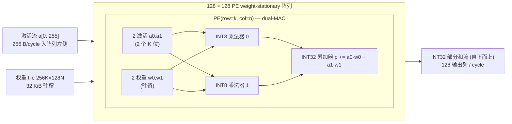
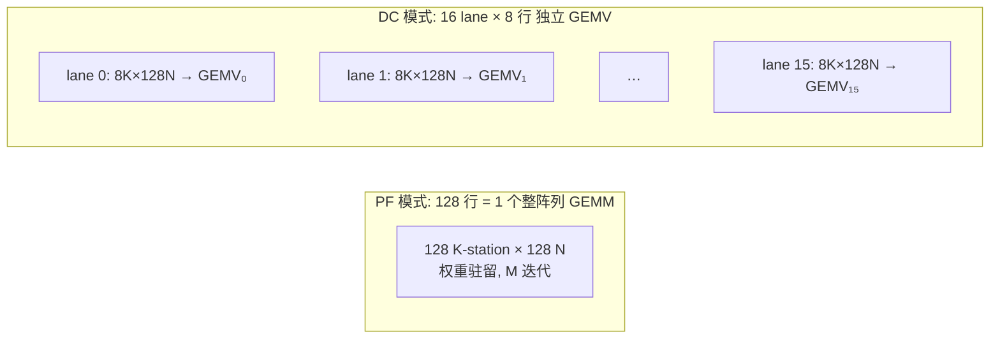

# 04 执行引擎微架构规格（Matrix Engine + Vector Engine）

> 归属切片：ExecEngines。本文档描述 **Matrix Engine**（GEMM/GEMV/BMM）与 **Vector Engine**（18 条 VECTOR 指令）的微架构、数据通路、时序与吞吐。
>
> 权威边界：指令编码/字段语义归 **IsaSpec（02）**；内存系统（SRAM/HBM 带宽、bank 冲突、DMA）归 **MemorySystem（03）**；KV 协议归 **KvProtocol（05）**。本节只描述**执行单元**的行为/时序/吞吐，冲突时以跨切片契约（`docs/spec.md` 冻结决策）为准并报主会话。
>
> 所有数字必须能从契约推导，推导过程（公式 + 代入值）随文给出。

---

## 0. 术语与速查

| 符号 | 含义 |
|------|------|
| MAC | multiply-accumulate；1 MAC = 1 次乘法 + 1 次累加 |
| TMAC/s | 10^12 MAC/s；契约第 6 条峰值单位 |
| PE | 脉动阵列中的单个处理单元（本设计为 dual-MAC） |
| K-station | weight-stationary 阵列中承载一个 K 维位置的阵列行 |
| PF / DC | prefill / decode 双模（`MODE` 指令切换） |
| VRF | Vector Register File（向量寄存器文件） |
| lane | 阵列/向量引擎的并行数据通路（阵列行拆分的独立 GEMV lane；向量引擎的 128 元素 lane） |

峰值吞吐基准（契约第 6 条，本文全部与之对齐）：

| dtype | 每 PE 每周期 MAC | 阵列 MAC/cycle | 峰值 (1 GHz) |
|-------|-----------------|----------------|--------------|
| INT8 (W8A8) | 2 | 128×128×2 = **32,768** | **32.77 TMAC/s** |
| INT4 (打包) | 4 | 128×128×4 = 65,536 | **65.54 TMAC/s** |
| BF16 (2×INT8 分解) | 0.5 | 128×128×0.5 = 8,192 | **8.19 TMAC/s** |

推导：`128×128×2 = 32768 MAC/cycle`；`32768 × 1e9 Hz = 3.2768e13 = 32.768 TMAC/s ≈ 32.77 TMAC/s`。INT4 = 2× INT8 = 65.54；BF16 = INT8/4 = 8.19（见 §1.2）。

---

## 1. Matrix Engine 微架构

### 1.1 总体结构与 PE 单元

Matrix Engine 是一个 **128×128 PE 的 weight-stationary 脉动阵列**，每个 PE 为 **dual-MAC**（2 个 INT8 乘法器 + 1 个 INT32 累加路径）。

几何映射（与 IsaSpec `C[M×N]=A[M×K]×B[K×N]` 对齐）：

- **128 行 = K-station**（K 维；dual-MAC 使每行承载 2 个 K 位 → 每 tile 驻留 **256 K × 128 N** 权重）。
- **128 列 = N（输出列）**。
- **M（输出行）为时间维**：权重驻留，M 逐行流式迭代（weight-stationary 复用，M 越大权重复用率越高）。



数据流（经典 weight-stationary，与 TPU/Eyeriss 同构）：

1. **权重驻留**：每 tile 先加载 256 K × 128 N = 32,768 个 INT8 权重（32 KiB）到 PE，计算期间不动。
2. **激活流**：每周期 128 行各接收 2 个新激活（其 2 个 K 位）＝ 256 B/cycle（§4 带宽表），在行内自左向右经 128 列传播（1 PE/cycle）。
3. **部分和流**：每个 PE 把 `a·w` 加到自上方流下的 INT32 部分和，继续向下传播；经 128 行后底部输出完整点积。
4. **产出**：稳态每周期底部产出 1 个输出行（128 个 N 列 INT32 值，512 B/cycle）。

**时延与吞吐**：

- 填充/排空（fill/drain）＝ 水平传播 128 列 + 垂直传播 128 行 ＝ **256 cycle**（每 256-K 段一次，可被下一段流水重叠）。
- 稳态吞吐 ＝ 128 行 × 128 列 × 2 MAC = **32,768 MAC/cycle**（所有 PE 每周期满激活）。
- 稳态产出速率 ＝ 1 输出行（128 N 值）/cycle。

### 1.2 dtype 数据通路（INT8 / INT4 / BF16）

PE 内 2 个 INT8 乘法器是唯一算术基元，三种 dtype 都复用它：

**INT8（W8A8，基准）**：每个乘法器每周期 1 次 `INT8 × INT8 → 16b`，累加进 INT32。每 PE 2 MAC/cycle。

**INT4（打包，W4A8 数据通路，2× 吞吐）**：权重寄存器 8 bit 拆成 2 个 4-bit 权重 `w_hi|w_lo`；每个乘法器对**同一个激活** a 做 `a·w_hi` 与 `a·w_lo`（2 个 4b 权重共享 1 个激活），即 1 个 8×8 乘法器切分成 2 个 4×8 子乘法器。每 PE 2 乘法器 × 2 = **4 INT4-MAC/cycle** → 2× INT8 ＝ **65.54 TMAC/s**。两个子积分别进独立累加（或带 2^4 移位合并，见 §1.5 后处理），保持 INT32 精度。

**BF16（2×INT8 分解，1/4 吞吐）**：BF16 尾数（含隐含 1）为 8 bit 无符号 `M ∈ [128,255]`。将 `M` 拆成 2 个 4-bit nibble `M = M_hi·2^4 + M_lo`，则两个 BF16 的尾数乘：

```
Ma·Mb = Ma_hi·Mb_hi·2^8 + (Ma_hi·Mb_lo + Ma_lo·Mb_hi)·2^4 + Ma_lo·Mb_lo
```

即 **2×2 = 4 个 INT8 部分积**（每个 4×4 bit，符号扩展后落在 1 个 INT8 乘法器内），外加一条**共享指数路径**（指数相加 + 对阶 + 归一化 + 舍入到 8 bit 尾数）。"2×INT8 分解"＝ 每个 BF16 尾数拆为 2 个 INT8 子字，相乘得 4 个部分积。每 PE 2 个乘法器每周期只能算 2 个部分积 → **1 个 BF16 MAC 需 2 cycle** → 每 PE 0.5 BF16-MAC/cycle → 32,768/4 = 8,192 MAC/cycle = **8.19 TMAC/s**。

| dtype | 每 PE 乘法器用法 | MAC/PE/cycle | 阵列峰值 (1 GHz) | 备注 |
|-------|-----------------|--------------|------------------|------|
| INT8 W8A8 | 2× (8b×8b) | 2 | 32.77 TMAC/s | 基准 |
| INT4 打包 | 2× 2×(4b×8b) | 4 | 65.54 TMAC/s | 2 个 4b 权重共享激活 |
| BF16 | 4 部分积/2 乘法器 | 0.5 | 8.19 TMAC/s | 2×INT8 尾数分解 |

> 补充：W4A16（INT4 权重 × BF16 激活）走 BF16 尾数路径——4-bit 权重与 8-bit 激活尾数相乘（1 个 INT8 部分积）+ 共享指数路径，吞吐与 BF16 同量级；其数值细节（scale 位置、误差阈值）属 P1/P4 量化工作，本节只定数据通路。

### 1.3 权重加载路径与时间

权重源有两路（契约 GEMM 允许 `B=权重 SRAM/HBM 流式`）：

1. **SRAM 驻留路径**（PF 常用）：权重由 DMA 预取进 SRAM，再经权重加载端口进阵列。
2. **HBM 直连流式路径**（DC 权重流用）：绕过 SRAM，DMA/流式控制器直接灌入阵列，上限 = HBM 带宽 1200 B/cycle（§2.4）。

**权重 tile 尺寸**＝ 256 K × 128 N × 1 B = **32 KiB**（32,768 B）。

**加载时间**（SRAM 路径）：

- 突发加载（独占比）：32 KiB ÷ 512 B/cycle = **64 cycle**。
- 重叠刷新（与计算共存，1 read/bank）：32 KiB ÷ 256 B/cycle = **128 cycle**。

**重叠论证**：PF 稳态下激活流占 256 B/cycle（1 read/bank），权重刷新占 256 B/cycle（另一 read/bank），合计 512 B/cycle = SRAM 读上限（16 bank × 2 read × 16 B，契约第 4 条）。一段 256-K 的计算时间 = M cycle（每输出行 1 cycle）。当 `M ≥ 128`（prefill 常态，M = prompt token 数）时，刷新 128 cycle ≤ 计算 M cycle，双缓冲完全隐藏权重加载；`M < 128` 时权重加载成为瓶颈（此情形出现在极小 batch，非 v0 目标）。

### 1.4 MATRIX 指令执行描述（GEMM / GEMV / BMM）

> 语义权威在 IsaSpec；此处给出执行引擎的时序/资源行为，确保每条指令都有执行描述（无孤儿）。

**GEMM（M×N×K tile）**

- A = 激活（SRAM，流式），B = 权重（SRAM 驻留或 HBM 流式），C = INT32 累加器。
- `acc 初值/清空`：累加器可清零（独立 tile）或载入初值（K 分块累加、残差 add）。
- `scale/dequant 指针`：经 C 寄存器指向 per-tensor / per-128-group scale，后处理（§1.5）消费。
- 执行：K 按 256 分段流式，N≤128 单次覆盖，M 逐行迭代。周期 ≈ `ceil(K/256) × M + 256`（fill/drain 摊平，大 M 下趋近 `M×K/256`）。
  - 例：Q 投影 `[128, 4096] × [4096, 4096]`（M=128, K=4096, N=128 tile）→ MAC = 128×128×4096 = 67.1 M，理想周期 = 67.1M/32,768 = **2048 cycle**。

**GEMV（M=1 特例，K 流式）**

- 单输出行（N=128），K 流式。**在 DC 模式下映射到 1 条 lane**（§2.2）；PF 模式下作为 M=1 的 GEMM 退化执行（阵列利用率低，故 decode 一律走 DC）。
- 执行（DC）：K=4096 = 32 段 × 128，每 lane 16 K/cycle → 8 cycle/段 → **256 cycle/批（16 lane 并行）**，见 §2.2。

**BMM（batched，attention 多 head）**

- batch ≤ 16（IsaSpec 冻结），DC 模式 batch 映射到 16 lane（每 lane 一个 batch 的 GEMV）；PF 模式 batch 映射为 M 维拼接的多个 GEMM（各 head 独立 tile）。
- attention `Q·K^T`：PF 下 32 head × `[128×128]×[128×128]`（M=128 token, N=128 token, K=128 head_dim），每 head 2.1M MAC × 32 = 67.1M MAC ≈ 2048 cycle（与 GEMM 同量级）；`transpose_B`（KV cache 存 K 为 `[seq×128]`）由 B 加载路径在 tile 时转置，无需额外数据通路（与 IsaSpec 对齐）。

### 1.5 后处理路径（INT32 → dtype / scale / bias）

阵列底部接一条 128 宽的后处理流水（每列 1 个处理单元，512 B/cycle INT32 读入），顺序为：

```
INT32 累加器输出
  → (1) per-group scale：INT32 × scale(fp32/bf16) → fp32/bf16 部分积
  → (2) 组间累加：per-128-group scale 时，各 128-K 组的部分积在 fp 域累加
  → (3) bias add：bias(fp32/bf16) 在 fp 域加（dequant 之后）
  → (4) dtype 转换/舍入：fp32 → BF16/INT8/INT4 目标 dtype
```

关键决策：

- **per-128-group scale 不进入 INT32 累加器**（各组 scale 不同，不能在 INT32 内统一缩放）。实现：K=4096 = 32 组，每组的 INT32 部分积在 `(1)` 立即乘该组 scale 转 fp，再在 `(2)` fp 累加 32 组。硬件代价：后处理单元的 fp 累加器（128 宽，fp32）。
- **bias 不并入 INT32 acc**，在 `(3)` fp 域加——与 HF 数值语义一致（bias 在浮点域作用于完整点积），避免 INT32 定点对齐偏差。
- **INT4 打包的 2^4 对齐**：§1.2 中 `w_hi`/`w_lo` 两个子积按 4-bit 权重位权合并时，后处理在 scale 前完成 `p_hi·16 + p_lo` 或等价移位，再统一 per-group scale。

后处理吞吐 128 值/cycle，与阵列产出 1 行/cycle 匹配；scale 指针经 C 寄存器间接寻址 SRAM（每 128-K 组读 1 个 scale，带宽可忽略）。

---

## 2. 双模阵列（PF / DC）

> 核心卖点。同一 128×128 阵列，`MODE` 指令（SYS，语义归 IsaSpec）切换两种数据流：prefill 整块 GEMM（算力受限），decode 多路 GEMV（带宽受限）。本节给全部数字推导并证明 decode 为 HBM-bound。

### 2.1 PF 模式（整阵列 GEMM）

- 128 行 = 128 K-station（×2 = 256 K 驻留），128 列 = N，M 维时间迭代，权重驻留复用。
- 稳态：激活 256 B/cycle + 权重刷新 256 B/cycle = SRAM 读满 512 B/cycle；产出 1 行/cycle。
- **算力受限论证**：prefill 每 tile 计算 `M×256×128` MAC，权重 `256×128` B。权重复用因子 = M（每权重被 M 个输出行复用）。Qwen3 prefill M = prompt token 数（4K/8K ctx），M ≫ 1 → HBM 权重流量 = 计算流量/M，远低于 1.2 TB/s。例：Q 投影 `[M=128, K=4096, N=4096]`，MAC = 2.15e9，INT8 计算 65.5 µs；权重 16.8 MB，HBM 加载 14 µs < 65.5 µs → **计算受限**（BF16 计算 4× = 262 µs，权重 33.6 MB/28 µs，仍计算受限）。✓

### 2.2 DC 模式（16 lane 独立 GEMV）

**拆分**：128 行 → **16 lane × 8 行**。每 lane = 8 K-station × 128 N 列 = 1024 PE，独立算一个 GEMV（M=1, N=128, K 流式）。



**K 流式（K=4096）**：`K = 4096 = 32 段 × 128`。每段 128 个 K 值经 lane 的 8 K-station × 2 (dual-MAC) = **16 K/cycle** 处理，故每段 128/16 = **8 cycle**；32 段 × 8 = **256 cycle/批**（16 lane 并行完成 16 个 GEMV）。

- 每 lane MAC = 4096 × 128 = 524,288；16 lane = 8.39 M MAC；8.39M / 32,768 = 256 cycle ✓。
- 每 lane 权重 = 4096 × 128 × 1 B = 512 KiB；16 lane = **8 MiB**（全批）。

**DC 权重流带宽需求（关键推导）**：

```
全速 DC 权重带宽 = 8 MiB / 256 cycle = 32 KiB/cycle = 32,768 B/cycle
                = 32.77 TB/s @ 1 GHz   (1 B 权重 / 1 MAC, 无 M 复用)
```

对比 HBM：契约第 5 条 HBM 聚合 1.2 TB/s = **1200 B/cycle @ 1 GHz**（1.2e12 / 1e9）。

```
DC 权重需求 / HBM 带宽 = 32,768 / 1,200 = 27.3×
```

**结论：decode 在 DC 模式下权重带宽短缺 27.3×，HBM-bound，阵列被迫降至 1.2 TMAC/s（INT8），利用率 = 1200/32768 = 3.66%。**

**DC GQA 广播 B 侧地址派生规则（P7 M6 回注，冻结）**：

DC 模式 BMM（attention `Q·Kᵀ` / `AV`）的 `batch` 映射到 16 lane，每 lane 一个 Q head 的
GEMV；B 侧（K 或 V tile）按 ISA 的 `batch_stride_B` 寻址：

```
B[b] 基址 = ARb + b × batch_stride_B      （byte，b ∈ [0, batch)）
```

当 `q_heads > kv_heads`（GQA 组内共享）时，B 侧对同一 KV head 的多个 Q head **广播**：
compiler 把共享同一 KV head 的若干 Q head 的 `batch_stride_B` 编码为 **0**，使这些 lane
的 B 基址都等于 `ARb`（同一 K/V tile），而 A 侧（Q）与 C 侧（输出）仍按各自的
`batch_stride_A` / `batch_stride_C` 独立寻址。硬件在 DC 模式对 B 侧无额外广播网络——
16 lane 的 B 加载端口直接复用同一 `ARb` 地址流（`batch_stride_B=0` 时地址生成器不累加），
零冲突地复用 SRAM 读口（每个 tile 只读一份 K/V，带宽为无广播情形的 `1/GQA`）。
该规则是 02 §6.1 DC 注的 B 侧实现约定；`batch_stride_B=0` 与 `>0` 两种编码均为合法，
语义由 IsaSpec `batch` / `CB` 字段给出，本回注只冻结 B 侧地址派生（`ARb + b×batch_stride_B`，
`batch_stride_B=0` 即广播）。

### 2.3 模式切换代价

`MODE (PF↔DC)` 一次切换的硬件代价（cycle）：

| 步骤 | 代价 | 说明 |
|------|------|------|
| 流水排空 | 256 cycle | 阵列 fill/drain 深度，冲走在途部分和 |
| lane 重构 | 16 cycle | 16 lane 路由 MUX 重配 + 控制广播 |
| 权重重载 | 32 cycle | DC 首 tile 16 KiB @ 512 B/cycle（可与首段计算重叠） |
| **合计** | **≈ 300 cycle** | ≈ 0.3 µs @ 1 GHz |

**摊销**：一次请求只发生一次切换（prefill 全部走 PF，decode 全部走 DC），摊销在数千 token 的 decode 上（每 token ≥ 6 ms，§2.4），**忽略不计**。调度器（P6）应批处理 prefill/decode 阶段、避免逐层来回切换。

### 2.4 decode 每 token 每层 HBM 流量与理论 token/s 上限

**每层权重参数**（由契约第 10 条数值规格推导，Qwen3-8B dense）：

| 投影 | 形状 | 参数 |
|------|------|------|
| Q | 4096 × 4096 | 16.78 M |
| K | 4096 × 1024 | 4.19 M |
| V | 4096 × 1024 | 4.19 M |
| O | 4096 × 4096 | 16.78 M |
| gate | 4096 × 12288 | 50.33 M |
| up | 4096 × 12288 | 50.33 M |
| down | 12288 × 4096 | 50.33 M |
| **每层合计** | — | **192.93 M** |

**每 token 每层 HBM 流量**（decode，M=1 无权重复用，权重读一遍）：

| dtype | 每层 (B) | 36 层 (B) | lm_head¹ (B) | **每 token 合计** |
|-------|----------|-----------|--------------|-------------------|
| BF16 | 385.9 M | 13.9 G | 1.24 G | **≈ 15.1 GB** |
| INT8 | 192.9 M | 6.95 G | 622 M | **≈ 7.57 GB** |
| INT4 | 96.5 M | 3.47 G | 311 M | **≈ 3.78 GB** |

> ¹ lm_head = 151936 × 4096 = 622.3 M **已计入上表**（untied，独立权重；无论 tied 与否每 token 都必须全读 lm_head）；input embedding 只读单行 4096 元素（8 KB），忽略。KV 流量见下方修正注（全窗口重读，长上下文不可忽略）。参数总量已由 01-target-model 逐字节核验（8.19B 总、192.93M/层）。

**理论 token/s 上限（HBM 天花板）**＝ `带宽 ÷ 每 token 字节`：

| dtype | 峰值 1.2 TB/s | sustained 720 GB/s（03 §3.4 口径） |
|-------|---------------|-------------------------------------|
| BF16 | 1.2e12 / 15.1e9 ≈ **79** | 720e9 / 15.1e9 ≈ **47.7** |
| INT8 | 1.2e12 / 7.57e9 ≈ **159** | 720e9 / 7.57e9 ≈ **95.1** |
| INT4 | 1.2e12 / 3.78e9 ≈ **317** | 720e9 / 3.78e9 ≈ **190.5** |

（P6 验收锚定 sustained 720 GB/s 列，见 §2.5。）

> **KV 窗口重读修正**（05 §5.2 全窗口口径；P1 roofline §6 发现并核验）：decode 每 token 除权重读外，
> 还从 HBM 重读**整个 K/V 窗口**（KV.GATHER 载入 [0,pos]；SRAM 仅 8 MiB 无法驻留长窗口）。
> 每 token KV 重读 = `KV_B × ctx`：8B 口径 KV_B = 147,456 B → @4K +0.604 GB、@8K +1.208 GB；
> 0.6B 口径 KV_B = 114,688 B → @4K +0.470 GB、@8K +0.940 GB（0.6B@8K 为权重读的 158%）。
> **修正后 sustained 天花板（INT8）**：8B @4K ≈ 88 / @8K ≈ 82 token/s（权重 7.57 GB）；
> 0.6B @4K ≈ 675 / @8K ≈ 469 token/s（权重 0.596 GB）。P6 验收口径随 context 而定；
> KV 重读消减（streaming/选择性重读）列为 P6 优化项。

**交叉验证（时间域）**：decode 每层 INT8 = 192.9 MB / 1.2 TB/s = **160.7 µs**；同层 DC 计算全速 = 192.93M MAC / 32.77e12 = **5.9 µs**。160.7/5.9 = **27.3×** ✓（与 §2.2 一致）。36 层 = 5.79 ms + lm_head 518 µs ≈ **6.3 ms/token → 159 token/s** ✓。

### 2.5 双模利用率分析总结

| 模式 | 瓶颈 | 阵列利用率 (INT8) | 依据 |
|------|------|-------------------|------|
| PF（prefill） | **计算** | ~94–99% | M≫1 权重复用，HBM 流量 = 计算/M，远低于 1.2 TB/s |
| DC（decode） | **HBM 权重流** | **3.66%** | M=1 无复用，1 B 权重/MAC，需求 32.77 TB/s vs 1.2 TB/s |

P6 验收「decode 达 HBM roofline 80%+」以 **sustained 720 GB/s 口径**为准（INT8 ≈ 95 token/s，80% ≈ 76 token/s；短上下文口径——长上下文按 §2.4 修正注随 context 下调）。

---

## 3. Vector Engine 微架构

### 3.1 总体结构与峰值

- **128-lane SIMD**，每 lane 每周期 1 个 BF16（或 INT8）元素 op。
- **VRF**：64 × 128 元素 × 16 bit = 16 KiB；3 端口（2 读 1 写，各 256 B/cycle，§4）。
- **峰值**：128 元素-op/cycle = **128 GOP/s @ 1 GHz** = BF16 标量运算 **0.128 TFLOP/s**（无 FMA；若将来加 FMA 则 0.256）。
- **定位**：逐元素/规约辅助引擎。对比 Matrix 32.77 TMAC/s（= 65.5 TOPS），Vector 约 1/256，符合“软最大值/归一化/RoPE/SwiGLU 等低算术强度 op 专用”的定位——这些 op 的 op 数是 O(hidden)=4096/token，而 GEMM 是 O(hidden²)，Vector 无需与 Matrix 同规模即可不拖后腿（§3.4 末尾交叉验证）。

### 3.2 指令吞吐/延迟表（覆盖契约全部 18 条 VECTOR）

> 延迟 = 输入就绪到结果写回 VRF 的 cycle；吞吐 = 流水化后每 cycle 可完成的独立 128 元素向量（单发射，1 指令/cycle）。

| 指令 | 延迟 (cyc) | 吞吐 (向量/cyc) | 实现 |
|------|-----------|-----------------|------|
| VADD / VSUB | 2 | 1 | BF16 加法器（对阶+加+归一化） |
| VMUL | 3 | 1 | BF16 乘法器 |
| VMAX | 2 | 1 | BF16 比较器 |
| VMOV | 1 | 1 | 寄存器搬运/选择 |
| VSCALE | 3 | 1 | VMUL 标量广播版 |
| VMASK | 1 | 1 | causal 掩码位 → 生成 0/−inf 选择 |
| VDIV | 10 | 1 | VRECIP + VMUL（NR） |
| VRECIP | 7 | 1 | LUT 种子 + 2 步 Newton-Raphson |
| VRSQRT | 7 | 1 | LUT 种子 + 2 步 NR |
| VEXP | 8 | 1 | LUT + 分段 3 阶多项式（§3.3） |
| VSILU | 9 | 1 | σ(x)=1/(1+e⁻ˣ) 复用 EXP + VMUL |
| VREDUCE_SUM | 8 | 1 规约/8 cyc | 7 级树（§3.3），128→1 |
| VREDUCE_MAX | 8 | 1 规约/8 cyc | 7 级比较树 |
| ROPE | 8 | 1 | 4 乘 + 2 加（旋转对）+ sin/cos LUT |
| RMSNORM | 见 §3.4 | 见 §3.4 | 微码复合（normal / per-head 两模式位） |
| QUANT | 5 | 1 | scale 乘 + 舍入 + clamp（per-tensor / per-128-group） |
| DEQUANT | 5 | 1 | scale 乘 + clamp |

### 3.3 特殊单元实现

**VEXP / VRSQRT（LUT + 插值，精度目标 = BF16 尾数误差 ≤ 0.5 ulp）**

- **VEXP**：`e^x = 2^(x·log₂e)`。令 `y = x·log₂e`，拆 `y = i + f`（i 整数，f ∈ [0,1)）。查 LUT 得 `2^f` 的 BF16 近似，用 3 阶多项式 `p(f) ≈ 2^f`（1 次查表 128 项 + 3 次乘加）修正，结果 `2^i × p(f)`（i 只移指数）。尾数误差 ≤ 0.5 ulp（8 bit 尾数 → 目标 ~6e-3 相对误差，3 阶多项式在 [0,1) 区间足够）。
- **VRSQRT**：LUT 给 8-bit 种子（按指数偏置 + 尾数高 4 bit 索引），2 步 Newton-Raphson（`r ← r·(3 − x·r²)/2`），收敛到 BF16 尾数精度。VRECIP 同理（`r ← r·(2 − x·r)`）。
- 每 lane 独立 LUT（128 份小型 LUT，或共享 1 份 + 128 路读口），吞吐 128 元素/cycle。

**VREDUCE_SUM / VREDUCE_MAX（7 级树）**

- 128 → 64 → 32 → 16 → 8 → 4 → 2 → 1，共 **7 级**，每级 1 cycle（加法/比较树），+ 1 cycle 写回 = **8 cycle 延迟**。流水化后吞吐 = 1 个独立规约/cycle（128 元素持续流入）。
- 跨块规约（>128 元素，如 RMSNorm 的 4096）：先 32 个 128 块各规约出 1 部分和，再对 32 部分和规约 1 次（5 级树）。

### 3.4 复合指令序列与 cycle 估算

> 估算模型：单发射、顺序、各指令延迟如上表；周期 = 发射周期数 + 关键路径排空。给出的 cycle 为 v0 近似，P3 时序模拟器将精化。

**Softmax**（每行 = 1 个 query 对 L 个 key；L≤128 单块）

序列：`VMASK`（causal 0/−inf）→ `VREDUCE_MAX` → `VSUB(max)` → `VEXP` → `VREDUCE_SUM` → `VDIV(1/sum)` ＝ **6 指令**。
关键路径延迟 ≈ 8(max)+2+8(exp)+8(sum)+10(div) = **36 cycle/行**；流水吞吐 6 cycle/行。

- **prefill（128 token）**：128 行 × 32 head = 4096 行 → 4096×6 = 24,576 发射 + 36 排空 ≈ **24.6K cycle**（每层 32 head）。
- **decode（1 token，L≤128）**：32 head × 6 + 36 ≈ **228 cycle**。
- L>128（长上下文 decode）：跨块 max/sum 各 +1 次规约，≈ 64 块 × 6 + 全局规约 ≈ **~360 cycle**（L=8192），不影响权重流主导的 decode 结论。

**RMSNorm**（normal 模式 = hidden 4096 = 32 块；per-head 模式 = 128 = 1 块）

微码（normal，每 token）：32×`VMUL`(x²) + 32×`VREDUCE_SUM` + 1×`VREDUCE_SUM`(32 部分和) + `VSCALE`+`VADD`(mean=Σ/4096+eps) + 1×`VRSQRT` + 32×`VMUL`(x·w·rsqrt) ≈ **100 发射 + 排空 ≈ 110 cycle/token**。
per-head（128）：1×`VMUL`+1×`VREDUCE_SUM`+2+1×`VRSQRT`+1×`VMUL` ≈ **16 cycle**。

- prefill 128 token（normal）：128 × 110 ≈ **14.1K cycle**。
- decode 1 token：normal 2 个（输入 + pre-MLP）× 110 = 220 cycle；QK-norm per-head 40 个（32 Q + 8 K）× 16 ≈ 220 cycle（流水）；合计 ≈ **440 cycle/token**。

**RoPE**（per token：Q 32×128 + K 8×128 = 5120 元素 = 40 块）

序列（每 128 元素块）：`ROPE`（内部 4 乘 + 2 加 + sin/cos LUT，8 cycle）＝ 1 指令。
- prefill 128 token：40 × 128 = 5120 指令 ≈ **5.1K cycle**。
- decode 1 token：40 指令 + 8 排空 ≈ **48 cycle**。

**SwiGLU**（per token：gate 12288 + up 12288 = 96 块 × 2 指令）

序列：96×`VSILU`(gate) + 96×`VMUL`(up ⊙ silu) ＝ 192 指令。
- prefill 128 token：192 × 128 = 24,576 指令 ≈ **24.6K cycle**。
- decode 1 token：192 + 9 ≈ **201 cycle**。

**交叉验证（Vector 不成为瓶颈）**：decode 每 token 全部 Vector op ≈ 440(norm)+228(softmax)+48(rope)+201(swiglu) ≈ **~0.92K cycle ≈ 0.92 µs**，远小于 decode 权重流 6.3 ms（INT8），占比 **<0.02%**——decode 瓶颈是 HBM 权重流，Vector 有 3 个数量级余量。prefill 每 token 每层 Vector ≈ 672 cycle < Matrix GEMM 5.9K cycle/token，也不拖后腿。✓

---

## 4. 引擎间互连带宽表

SRAM 结构（契约第 4 条）：16 bank × 512 KiB，粒度 16 B，每 bank 每周期 ≤2 读 + 1 写 → **读上限 512 B/cycle，写上限 256 B/cycle**。

| 路径 | 方向 | 带宽 (B/cycle) | 论证 |
|------|------|----------------|------|
| SRAM → Matrix 激活流 | 读 | 256 | 128 行 × 2 激活 × 1 B |
| SRAM → Matrix 权重刷新 | 读 | 256 | 32 KiB/128 cycle（重叠，1 read/bank） |
| SRAM → Vector VRF | 读 | 256 | 128 lane × 2 B（BF16） |
| Vector VRF → SRAM | 写 | 256 | 128 lane × 2 B |
| Matrix INT32 累加器 → 后处理/Vector | 内部直连 | 512 | 128 列 × 4 B，1 行/cycle |
| VRF 读口（2 个） | 内部 | 2 × 256 | 二进制 op 双操作数 |
| HBM → Matrix 权重（直连流式） | 读 | 1200 | 1.2 TB/s @ 1 GHz（DC 权重流） |

**Vector 喂满论证（契约要求 128×2B=256 B/cycle）**：128 元素 BF16 向量 = 256 B = 16 bank × 16 B，恰好每个 bank 1 次访问、**零 bank 冲突**，1 cycle 完成一次全向量装载 → VRF 读口 256 B/cycle 恒定喂满 128 lane。✓

**共享与仲裁**：Matrix（激活 256 + 权重 256）与 Vector（256）并不同时满速——二者被依赖图顺序化（GEMM → norm/softmax → GEMM）。SRAM 读 512 B/cycle 为共享资源：Matrix 激活(256) + Matrix 权重刷新(256) 在 PF 稳态恰好占满；Vector 满速时 Matrix 空闲。仲裁优先级（设计选择）：Matrix 权重刷新 > Matrix 激活 > Vector 载入，P6 调度据此排布。

---

## 5. 契约一致性自查

| 检查项 | 结论 |
|--------|------|
| 峰值 INT8 = 128×128×2 = 32,768 MAC/cycle = 32.77 TMAC/s | ✓ 与契约第 6 条一致 |
| INT4 打包 2× = 65.54 TMAC/s；BF16 2×INT8 分解 1/4 = 8.19 TMAC/s | ✓ §1.2 |
| 双模：PF 整块 GEMM / DC 16 lane×8 行 GEMV，K=4096 分 32 段×128 流式 | ✓ §2 |
| decode HBM-bound 结论明确（27.3× 短缺，利用率 3.66%，token/s 天花板 79/159/317） | ✓ §2.4/§2.5 |
| MATRIX 全指令（GEMM/GEMV/BMM）有执行描述 | ✓ §1.4 |
| VECTOR 全 18 条指令（VADD…DEQUANT）有吞吐/延迟 | ✓ §3.2 |
| Vector 128-lane 每 cycle 喂满 256 B/cycle | ✓ §4 |
| 模式切换代价给出（≈300 cycle） | ✓ §2.3 |
| 后处理（INT32→dtype、per-group scale、bias 不并入 acc） | ✓ §1.5 |

**未决项（不影响本节冻结）**：精确参数总量与 lm_head tied 与否（待 ModelGrounding 验证，数量级不变）；HBM 读/写拆分（归 MemorySystem，本节权重流按聚合 1.2 TB/s 读主导近似）。
